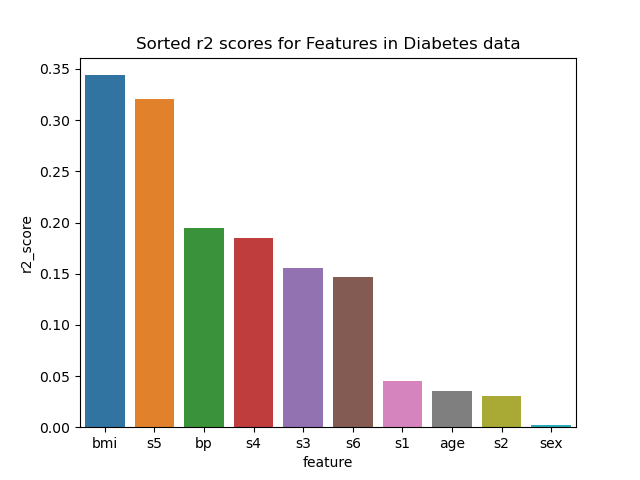
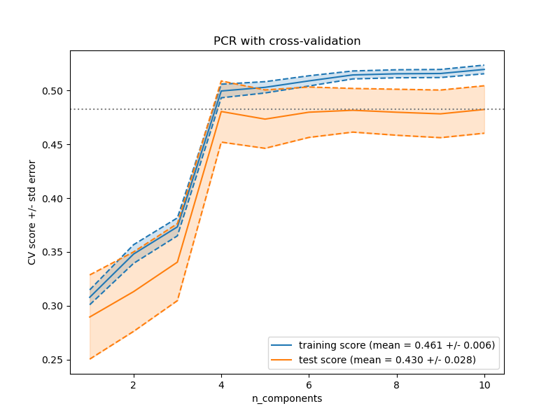
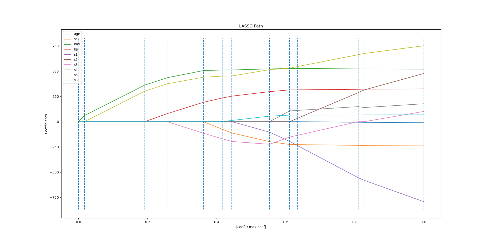

# hw-diabetes

## Goals

* Model-selection techniques using the diabetes dataset
* Comparison of feature ranking with $R^2$, forward selection and Lasso
* PCR (principal component regression) with cross validation to assess feature dimension

## Assignment

Use the diabetes dataset from [sklearn.datasets.load_diabetes](https://scikit-learn.org/stable/modules/generated/sklearn.datasets.load_diabetes.html) to answer the questions below.

## Question 1

Rank the features according to their squared correlation with the target. 
Note that squared correlation is the same as $R^2$ for univariate regression. 
Visualize the ordered scores with a bar chart.

- The following make command to execute the `q1.py` file followed by the output plot.

```
make q1
```



- We get the features in the following order with respective r2_score.

```
feature    score
bmi        0.343924
s5         0.320223
bp         0.194906
s4         0.185290
s3         0.155859
s6         0.146294
s1         0.044954
age        0.035302
s2         0.030295
sex        0.001854
```

## Question 2

Rank the features according to the order that they're added in the [forward sequential feature selection](https://scikit-learn.org/stable/modules/generated/sklearn.feature_selection.SequentialFeatureSelector.html) algorithm. Use this ranking to reorder the bar chart in question 1.

- The following make command to execute the `q2.py` file followed by the output plot.

```
make q2
```


- After using `SequentialFeatureSelector` to reorder the features from question 1, we get the following order which is different from the order that we got previously.

```
['bmi', 's5', 'bp', 's3', 'sex', 's1', 's2', 's4', 'age', 's6']
```

## Question 3

Compare the bar charts in Questions 1 & 2.
Briefly discuss differences between the two charts and possible causes.
Add a figure to prove your point.

- The following make command to execute the `q3.py` file followed by the output plot.

```
make q3
```


- I have used a lineplot to plot the scores that I got in the question1 and also plotted the calculated r2_scores for the order I got in the question2 to get the above line plot. We can see that for n_components selected, the SequentialFeatureSelector feature order performs better than the r2_score sorted order after n=3.
- The forward `SequentialFeatureSelector` adds features in a greedy fashion to select the best feature to be added. This is different from comparing r2_scores for individual model predictions of target. And hence, the forward `SequentialFeatureSelector` performs better than the sorted r2_score order.

## Question 4

Plot cross-validation scores versus the number of components used in Principal Component Regression (PCR). 
(Recall the [PCR vs PLS](https://scikit-learn.org/stable/auto_examples/cross_decomposition/plot_pcr_vs_pls.html)
demo mentioned in class.)
Include both training and test scores.
Comment on the dimensionality of the dataset and the degree of overfitting.
Hint: The [CV-diabetes demo](https://scikit-learn.org/stable/auto_examples/exercises/plot_cv_diabetes.html),
which uses cross-validation to determine the best `alpha`, may be helpful in answering this question.

- The following make command to execute the `q4.py` file followed by the output plot.

```
make q4
```



- I have used the default 5-fold cross validation to get the train and test scores using `GridSearchCV`. The training scores (mean = 0.454 +/- 0.006) are better than testing scores (mean = 0.424 +/- 0.028).
- The training score increases as the number of components increase. We can see that for data with n=4 features there is not a big difference in the train and test scores and also where we get the best test score. After that we can see that the difference between the training and test scores keeps either increasing or there might not be no change indicating overfitting.

## Question 5

The [lasso lars demo](https://scikit-learn.org/stable/auto_examples/linear_model/plot_lasso_lars.html) computes and plots the coefficients with lasso. Add a legend to the plot so that you can relate colors to feature names. Briefly compare the lasso ordering to your answers above.

- The following make command to execute the `q5.py` file followed by the output plot.

```
make q5
```



- We can see in the above plot that the feature's coefficients first improve either positively or negatively in the following order:

```
['bmi', 's5', 'bp', 's3', 'sex', 's6', 's1', 's4', 's2', 'age']
```

- I have built a model using the above order as the 3rd and when I plotted it along with what I had in the question 3 plot, we can observe that the model with lasso order performs better than the r2_score sorted order for n=9 features, however it is as close as the order of `SequentialFeatureSelector`. The following is an image of the same:


